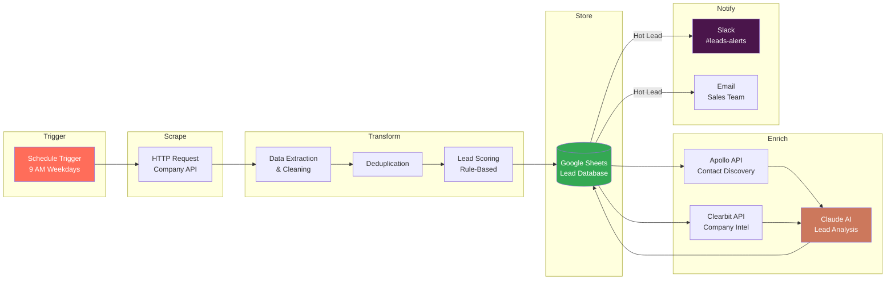
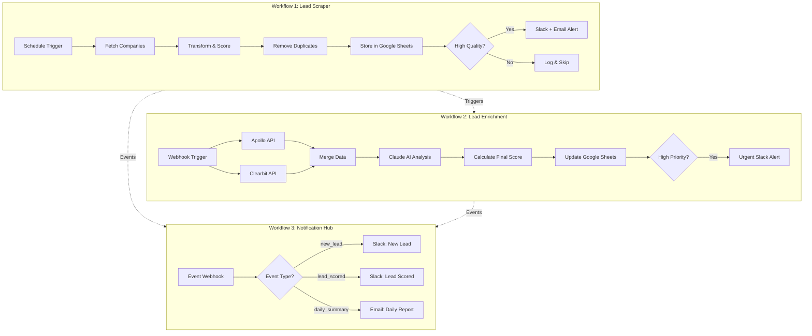

# n8n Lead Generation Automation


An end-to-end automated lead generation pipeline built with **n8n**, featuring AI-powered lead scoring via **Claude API**, multi-source data enrichment, and real-time multi-channel notifications.

---

## What It Does

This automation replaces hours of manual prospecting work with a fully automated pipeline that:

1. **Scrapes** potential customer data from APIs on a daily schedule
2. **Transforms** raw data into structured, scored leads
3. **Enriches** leads with additional company intelligence (Apollo, Clearbit)
4. **Scores** leads using Claude AI for intelligent qualification
5. **Stores** everything in Google Sheets for easy team access
6. **Notifies** your sales team instantly via Slack and email when hot leads arrive

---

## Architecture



### Data Flow Detail



---

## Workflow Screenshots

> **Note:** Replace these placeholders with actual n8n workflow screenshots.

| Workflow | Screenshot |
|----------|------------|
| Lead Scraper |  |
| Lead Enrichment |  |
| Architecture Overview |  |

---

## Features

- **Automated Lead Scraping** - Daily scheduled data collection from company APIs with configurable filters (industry, size, location)
- **AI-Powered Lead Scoring** - Claude AI analyzes leads and provides intelligent qualification scores, buying signals, and recommended actions
- **Multi-Source Enrichment** - Combines data from Apollo (contacts) and Clearbit (company intel) for comprehensive lead profiles
- **Google Sheets Integration** - Centralized lead database accessible to the entire sales team with auto-updated enrichment data
- **Real-Time Notifications** - Instant Slack alerts for hot leads with detailed summaries; email digests for daily reports
- **Smart Deduplication** - Automatically prevents duplicate entries based on company name and website
- **Customizable Filters** - Easily adjust scoring rules, quality thresholds, and notification triggers
- **Composite Scoring** - Weighted combination of rule-based (40%) and AI-based (60%) scoring for balanced lead qualification

---

## Prerequisites

| Service | Purpose | Free Tier |
|---------|---------|-----------|
| [n8n](https://n8n.io/) | Workflow automation engine | Self-hosted (free) |
| [Google Cloud](https://console.cloud.google.com/) | Sheets API + OAuth2 | Yes |
| [Anthropic](https://console.anthropic.com/) | Claude API for AI scoring | Pay-per-use |
| [Apollo.io](https://www.apollo.io/) | Contact & company enrichment | Free tier available |
| [Clearbit](https://clearbit.com/) | Company intelligence | Free tier available |
| [Slack](https://api.slack.com/) | Team notifications | Yes |
| [Docker](https://www.docker.com/) | Running n8n locally | Yes |

---

## Setup

### Quick Start

```bash
# 1. Clone the repository
git clone https://github.com/YOUR_USERNAME/n8n-lead-generator.git
cd n8n-lead-generator

# 2. Run the setup script
chmod +x scripts/setup.sh
./scripts/setup.sh

# 3. Open n8n
open http://localhost:5678
```

### Manual Setup

1. **Start n8n** with Docker:
   ```bash
   docker run -d --name n8n \
     -p 5678:5678 \
     -v ~/.n8n:/home/node/.n8n \
     n8nio/n8n:latest
   ```

2. **Configure credentials** - Copy and edit the config template:
   ```bash
   cp config/credentials.example.json config/credentials.json
   # Edit with your actual API keys
   ```

3. **Import workflows** into n8n:
   - Open n8n at `http://localhost:5678`
   - Go to **Workflows** > **Import from File**
   - Import all three files from the `workflows/` directory

4. **Set up Google Sheets**:
   - Create a new spreadsheet or import `templates/google_sheet_template.csv`
   - Update the `spreadsheet_id` in each workflow

5. **Configure Slack**:
   - Create the notification channels (`#leads-new`, `#leads-alerts`, `#sales-high-priority`)
   - Set up a Slack bot with posting permissions

6. **Activate workflows** and test with sample data from `scripts/sample_data.json`

---

## Workflow Configuration

### Lead Scraper (`workflows/lead_scraper.json`)

| Parameter | Default | Description |
|-----------|---------|-------------|
| Schedule | `0 9 * * 1-5` | Runs at 9 AM, Monday-Friday |
| Industry Filter | `technology` | Target industry for scraping |
| Employee Range | `50-500` | Company size filter |
| Location | `US` | Geographic filter |
| Hot Lead Threshold | `70/100` | Score cutoff for hot leads |

### Lead Enrichment (`workflows/lead_enrichment.json`)

| Parameter | Default | Description |
|-----------|---------|-------------|
| AI Model | `claude-sonnet-4-6` | Claude model for analysis |
| Rule-Based Weight | `40%` | Weight for initial scoring |
| AI Weight | `60%` | Weight for AI scoring |
| High Priority Threshold | `75/100` | Final score cutoff |

### Notification Hub (`workflows/notification.json`)

| Event Type | Channel | Format |
|------------|---------|--------|
| `new_lead` | `#leads-new` | Slack message |
| `lead_scored` | `#leads-scored` | Slack message |
| `daily_summary` | Email | HTML report |

---

## Customization Guide

### Adjusting Lead Scoring

The lead scoring algorithm in `lead_scraper.json` uses a point-based system:

```
Employee count (50-500):  +30 points
Contact email available:  +20 points
LinkedIn URL available:   +15 points
Website available:        +10 points
Phone available:          +10 points
Rich description:         +15 points
─────────────────────────────────────
Maximum:                  100 points
```

Modify the scoring logic in the **Transform & Score Leads** Code node to match your ideal customer profile (ICP).

### Adding New Data Sources

1. Duplicate the **HTTP Request** node in the Lead Scraper workflow
2. Configure the new API endpoint and authentication
3. Update the **Transform** node to handle the new data schema
4. Connect the nodes in the workflow

### Customizing AI Analysis

Edit the Claude API prompt in the **Lead Enrichment** workflow to analyze different signals:

```
Analyze this lead and provide:
- Qualification score (1-100)
- Buying signals detected
- Risk factors
- Recommended outreach strategy
- Ideal persona to target
```

---

## Use Cases

### 1. B2B SaaS Sales Pipeline

Automatically identify and score technology companies that match your ICP. The workflow scrapes company directories, enriches with tech stack data, and uses AI to predict purchase intent based on company signals.

### 2. Recruitment Lead Generation

Adapt the scraper to target companies that are actively hiring (a signal of growth). Use enrichment to find HR decision-makers and score companies based on hiring velocity, funding stage, and team size.

### 3. Partnership & Business Development

Configure the pipeline to identify potential partners in complementary industries. The AI scoring can evaluate strategic fit, market overlap, and mutual growth potential.

---

## Project Structure

```
n8n-lead-generator/
├── README.md                          # This file
├── .gitignore                         # Git ignore rules
├── workflows/
│   ├── lead_scraper.json              # Daily lead scraping + scoring
│   ├── lead_enrichment.json           # AI-powered data enrichment
│   └── notification.json              # Multi-channel notification hub
├── docs/
│   ├── architecture.png               # Architecture diagram
│   ├── workflow_screenshot.png        # n8n UI screenshots
│   └── flow_diagram.png              # Process flow diagram
├── scripts/
│   ├── setup.sh                       # One-click setup script
│   └── sample_data.json              # Test data for development
├── config/
│   └── credentials.example.json      # API key template (sanitized)
└── templates/
    └── google_sheet_template.csv     # Google Sheets column structure
```

---

## Tech Stack

| Component | Technology | Role |
|-----------|-----------|------|
| Orchestration | n8n | Workflow engine |
| AI/ML | Claude API (Anthropic) | Lead scoring & analysis |
| Storage | Google Sheets | Lead database |
| Enrichment | Apollo.io, Clearbit | Contact & company data |
| Notifications | Slack, SMTP Email | Real-time alerts |
| Infrastructure | Docker | Containerized deployment |

---

## Contributing

Contributions are welcome! Please feel free to submit a Pull Request.

1. Fork the repository
2. Create your feature branch (`git checkout -b feature/new-data-source`)
3. Commit your changes (`git commit -m 'Add new data source integration'`)
4. Push to the branch (`git push origin feature/new-data-source`)
5. Open a Pull Request

---

## License

This project is licensed under the MIT License - see the [LICENSE](LICENSE) file for details.

---

## Acknowledgments

- [n8n](https://n8n.io/) - The powerful workflow automation platform
- [Anthropic](https://www.anthropic.com/) - Claude AI for intelligent lead analysis
- [Apollo.io](https://www.apollo.io/) - Sales intelligence and engagement
- [Clearbit](https://clearbit.com/) - Business intelligence APIs
