# Architecture Documentation

Complete technical architecture of the n8n Lead Generation Automation system.

---

## Table of Contents

1. [System Overview](#system-overview)
2. [Layer 1: High-Level Architecture](#layer-1-high-level-architecture)
3. [Layer 2: Component Architecture](#layer-2-component-architecture)
4. [Layer 3: Data Flow](#layer-3-data-flow)
5. [Layer 4: Detailed Node-by-Node Flow](#layer-4-detailed-node-by-node-flow)
6. [Data Schema](#data-schema)
7. [Scoring Algorithm](#scoring-algorithm)
8. [Failure Handling](#failure-handling)

---

## System Overview

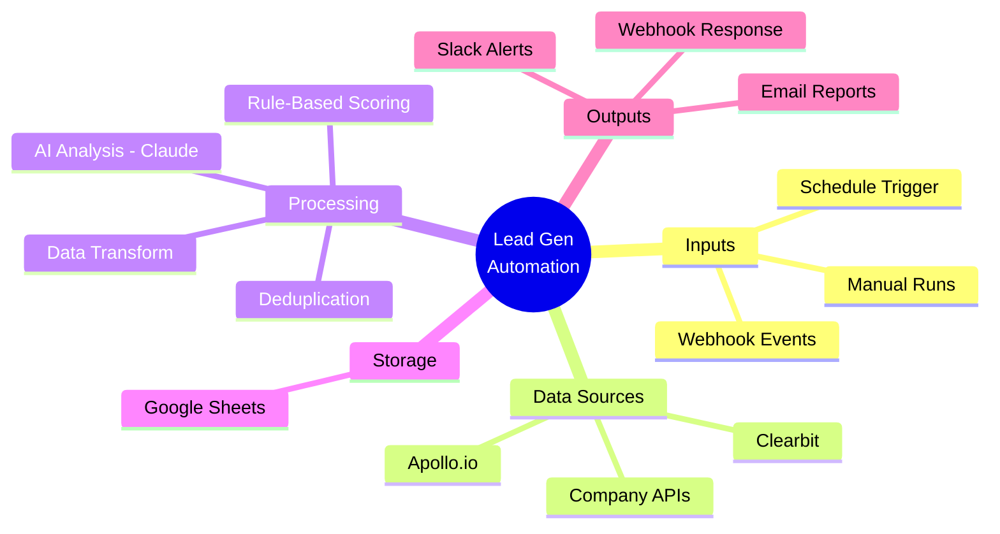

**Core concept:** Three independent but connected workflows that together automate the entire lead lifecycle from discovery to qualified handoff.

---

## Layer 1: High-Level Architecture

This is the 30,000-foot view — how the major pieces fit together.

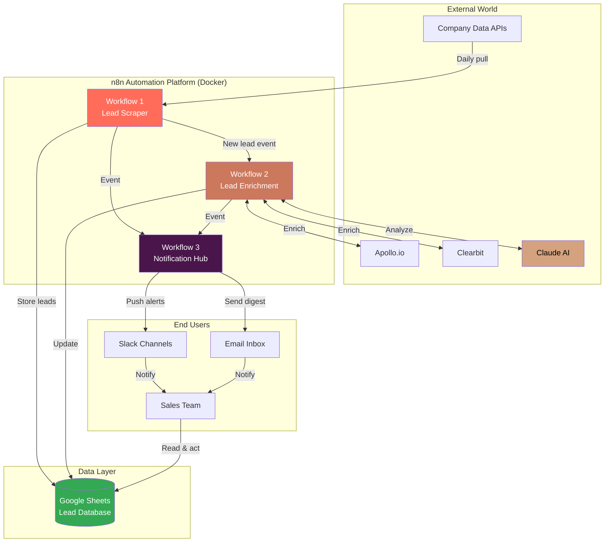

### Key Design Principles

| Principle | How It's Implemented |
|-----------|---------------------|
| **Separation of Concerns** | 3 separate workflows — each does one thing well |
| **Event-Driven** | Workflows trigger each other via webhooks |
| **Idempotent** | Deduplication prevents duplicate entries |
| **Observable** | Every run logs summary stats + notifications |
| **Fail-Safe** | One API failure doesn't stop the pipeline |

---

## Layer 2: Component Architecture

Zooming in on each workflow and what it contains.

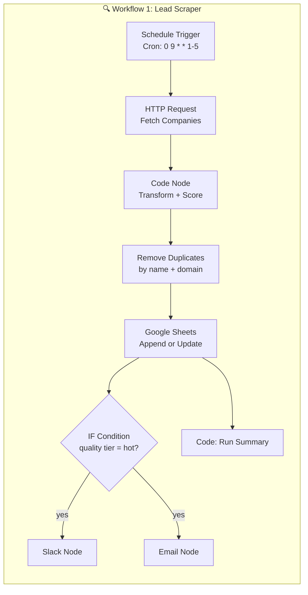

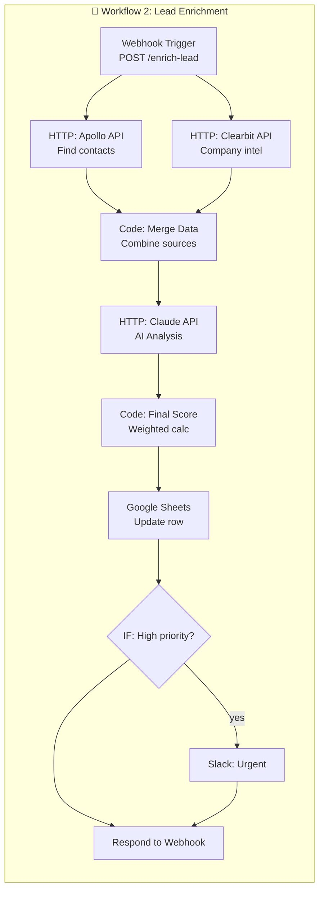

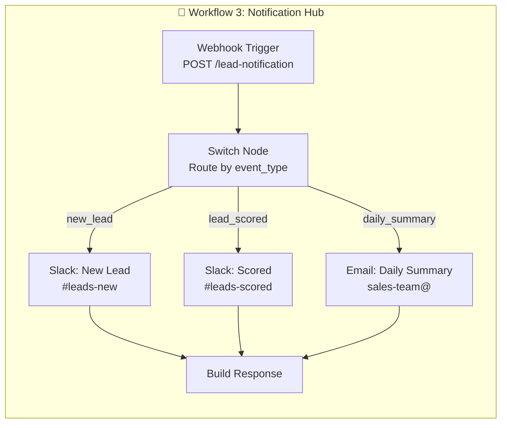

---

## Layer 3: Data Flow

How a single lead moves through the entire system from discovery to qualified handoff.

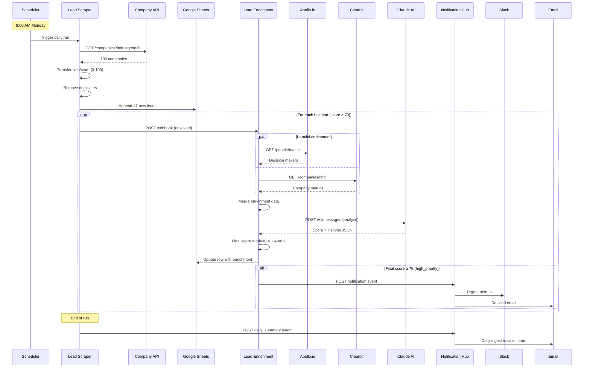

---

## Layer 4: Detailed Node-by-Node Flow

What actually happens inside each node.

### Workflow 1: Lead Scraper — Step by Step

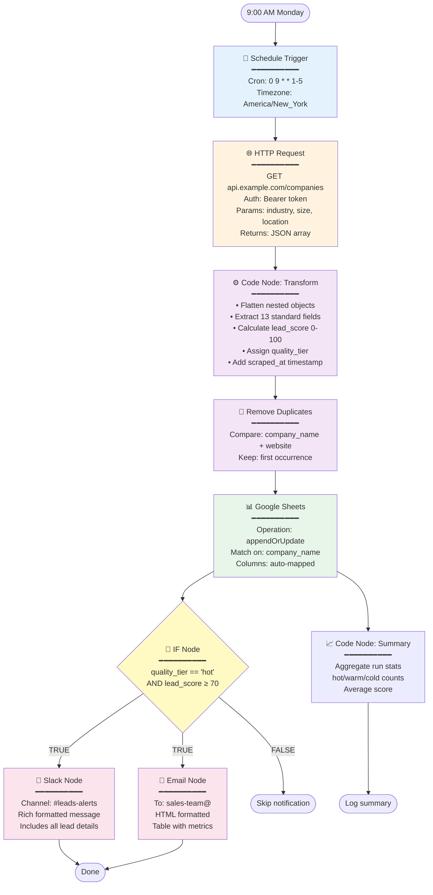

### Workflow 2: Lead Enrichment — Parallel Processing Pattern

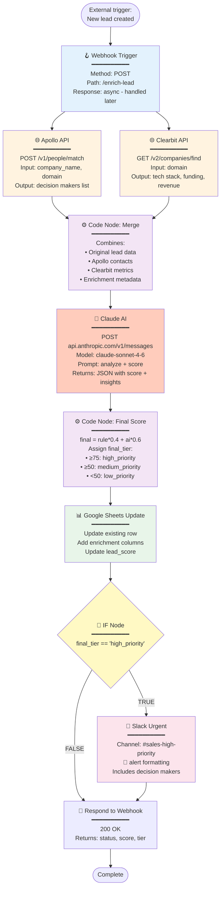

---

## Data Schema

### Lead Object Evolution

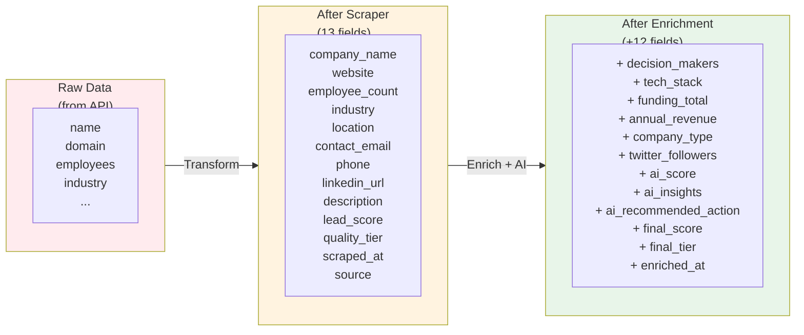

### Core Lead Schema

| Field | Type | Source | Example |
|-------|------|--------|---------|
| `company_name` | string | Scraper | "TechFlow Solutions" |
| `website` | string | Scraper | "techflow.com" |
| `employee_count` | integer | Scraper | 150 |
| `industry` | string | Scraper | "SaaS" |
| `lead_score` | integer | Rule-based | 75 |
| `quality_tier` | enum | Rule-based | "hot" / "warm" / "cold" |
| `decision_makers` | array | Apollo | `[{name, title, email}]` |
| `tech_stack` | array | Clearbit | `["AWS", "React"]` |
| `ai_score` | integer | Claude | 82 |
| `ai_insights` | string | Claude | "Strong buying signals..." |
| `final_score` | integer | Calculated | 79 |
| `final_tier` | enum | Calculated | "high_priority" |

---

## Scoring Algorithm

### Rule-Based Scoring (Workflow 1)

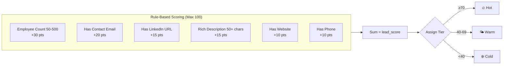

### AI Scoring (Workflow 2)

Claude AI receives the full enriched lead and returns:

```json
{
  "score": 82,
  "action": "schedule_demo",
  "insights": "Strong product-market fit signals...",
  "buying_signals": ["recent funding", "hiring sales team"],
  "risk_factors": ["competing vendor"]
}
```

### Composite Scoring (Final)

```
final_score = (rule_score × 0.4) + (ai_score × 0.6)
```

**Why 60/40 weighting?** The AI catches nuanced signals rule-based scoring misses (hiring velocity, market momentum, strategic fit), but we still trust hard data (firmographics) with 40% weight for stability.

---

## Failure Handling

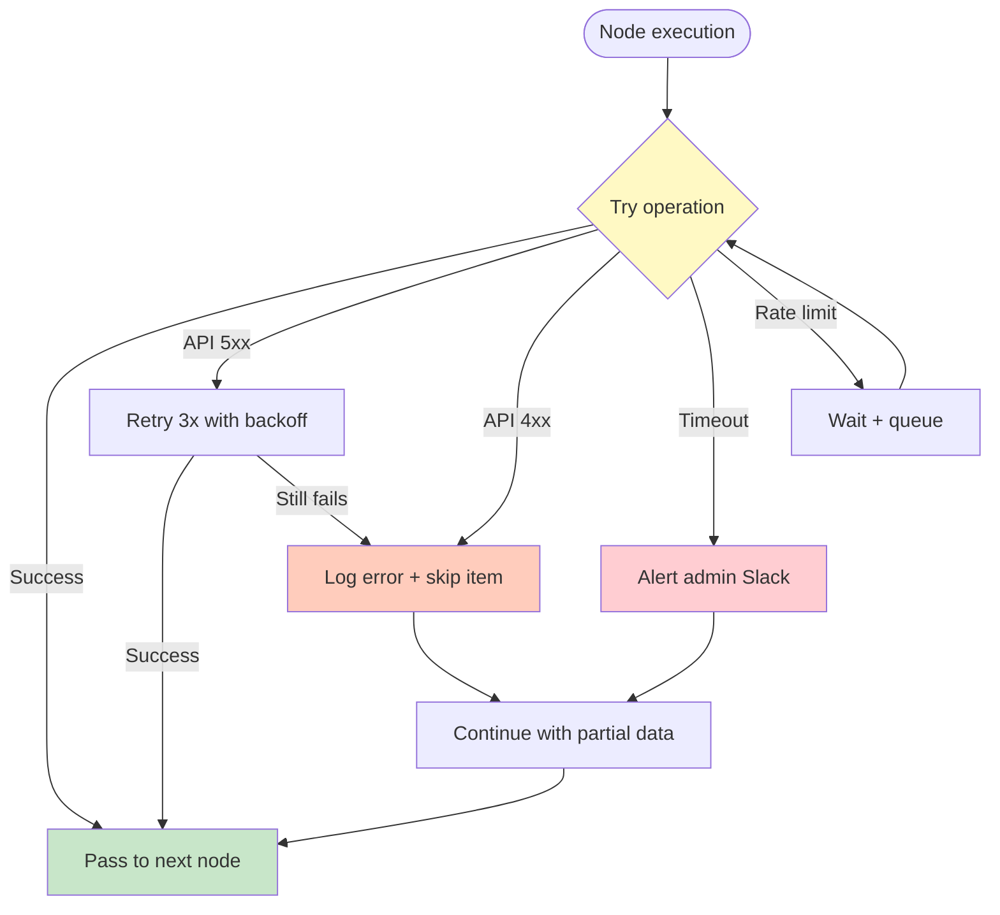

### Resilience Features

| Failure Type | Handling |
|--------------|----------|
| **API unavailable** | Skip that enrichment source, continue with partial data |
| **Rate limit hit** | Queue + retry with exponential backoff |
| **Bad data format** | Log error, skip record, continue batch |
| **AI API fails** | Fall back to rule-based score only |
| **Sheets write fails** | Retry 3x, then alert to #automation-errors |
| **Webhook timeout** | Async processing, acknowledge immediately |

---

## Why n8n?

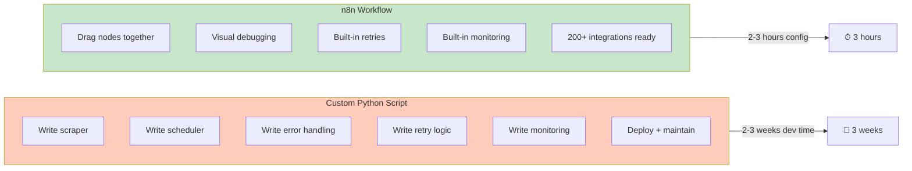

**n8n advantages for this use case:**

- Visual workflow editor — non-engineers can modify
- Built-in error handling + retry logic
- 400+ pre-built integrations (no SDK coding)
- Self-hosted (data privacy) or cloud
- Low/no-code for simple cases, full code when needed
- Webhook + scheduling built-in
- Visual execution history for debugging

---

## Execution Example

**Scenario:** Monday 9 AM, the daily scrape runs.

| Time | Event | Outcome |
|------|-------|---------|
| 09:00:00 | Cron triggers Workflow 1 | Started |
| 09:00:02 | API returns 100 companies | Success |
| 09:00:05 | Transform + score complete | 100 leads, 12 hot, 35 warm, 53 cold |
| 09:00:06 | Dedup removes 8 existing | 92 new leads |
| 09:00:10 | Google Sheets updated | 92 rows added |
| 09:00:11 | IF node: 12 hot leads match | Fork |
| 09:00:12 | Slack + email fired for 12 leads | Notifications sent |
| 09:00:15 | Workflow 2 starts for each hot lead | 12 parallel enrichments |
| 09:00:25 | Apollo + Clearbit return | Decision makers + intel loaded |
| 09:00:35 | Claude AI analyzes each lead | AI scores 65-92 |
| 09:00:40 | Final scores calculated | 5 high_priority, 7 medium |
| 09:00:42 | Sheets updated with enrichment | Done |
| 09:00:43 | 5 urgent Slack alerts fired | Sales team notified |

**Total time: ~43 seconds** from trigger to sales team having actionable data.

---

## Summary: The Mental Model

Think of this system as a **3-stage factory assembly line**:

1. **Discovery Line (Scraper)** — Raw material comes in, gets basic quality check, sorted by grade
2. **Enhancement Line (Enrichment)** — High-grade items get decorated with extra details and AI quality inspection
3. **Shipping Line (Notifications)** — Finished products routed to the right customer (sales rep / channel)

Each line runs independently, triggered by events from the previous one, and all three share the same storage (Google Sheets = warehouse).
